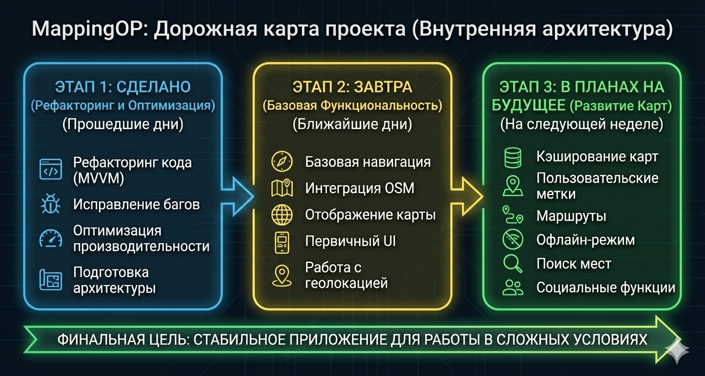
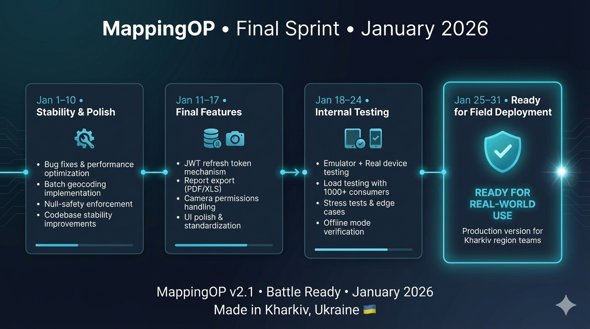

# MappingOP 🗺️

**MappingOP** is a high-tech solution designed to automate the work of field crews operating in active conflict zones. The app completely replaces paper-based worksheets, ensuring stable operation even in areas with no internet coverage and GPS interference.

---

## 🎯 О Проекте (About)

Проект решает критически важные задачи навигации и координации в сложных условиях.
MappingOP заменяет устаревшие бумажные методы цифровым решением, которое работает там, где другие приложения отказывают.

**Key Features:**
* 🛡️ **Автономность:** Полная работа без интернета (Offline-first).
* 📍 **Навигация без GPS:** Инструменты для ориентирования в условиях помех (GPS interference).
* 🚀 **Performance:** Мгновенная загрузка и работа с тяжелыми картами.

---

## 🛣️ Дорожная Карта (Roadmap)

Текущий статус разработки и планы по внедрению функционала.

*(Не забудьте проверить путь к файлу: `assets/` или другая папка, куда вы загрузили картинки)*

*(Please verify the file path matches your repository structure)*

---

## 🛠️ Технический Стек (Tech Stack)

Мы используем передовые технологии для обеспечения надежности и отказоустойчивости:

* **Core:** Kotlin, Coroutines, Flow.
* **UI:** Jetpack Compose & XML (Hybrid approach).
* **Architecture:** Clean Architecture + MVVM.
* **Maps:** OpenStreetMap (OSM) / osmdroid with custom caching logic.
* **Data:** Room Database (Local storage), DataStore.

---

## 👥 Команда (Team)

Над проектом работает специализированная команда:

* **[RoninSoulKh](https://github.com/RoninSoulKh)** — **Lead Developer**
    * *Responsibilities:* Architecture, Frontend, Logging, and Data Processing.
* **[EmsFear](https://github.com/EmsFear)** — **Backend Developer**
    * *Responsibilities:* Server-side logic and API synchronization.
* **[s1lentoath](https://github.com/s1lentoath)** — **UI/UX Designer**
    * *Responsibilities:* Interface concept and visual identity.

---

## 🤝 Участие (Contributing)

По вопросам доступа к репозиторию и контрибьютинга, пожалуйста, свяжитесь с Lead Developer.

---

*Developed for stability in the most unstable conditions.*
